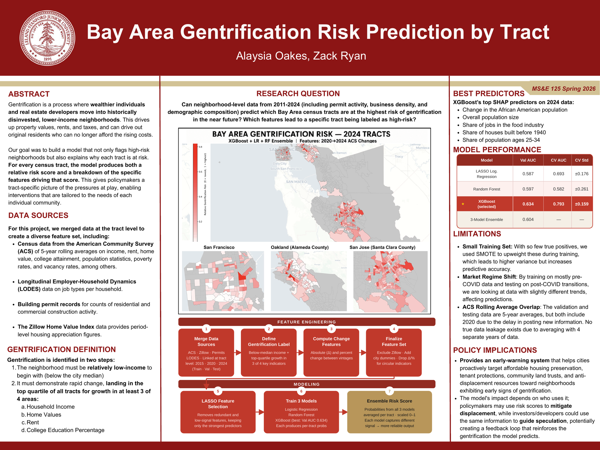
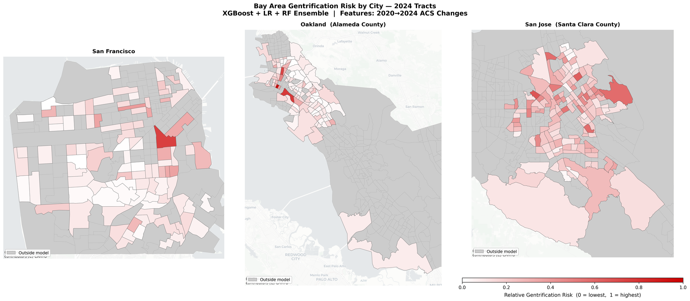

# Bay Area Gentrification Risk

Tract-level gentrification risk scoring for San Francisco, Oakland, and San Jose.
The model ranks **341 census tracts** by how likely they are to gentrify next, and
for each tract reports *which* features drove its score — so a city planner can
target anti-displacement resources by risk level **and** by mechanism, rather than
by intuition. Built from ACS, LEHD LODES, municipal building permits, and Zillow
ZHVI covering 2011–2024.

[](report/poster.pdf)

*The whole project on one page — [download the poster PDF](report/poster.pdf).*

**[→ Open the interactive map](https://zacharyryan2105.github.io/Gentrification-Risk-Modeling/)** — hover any tract for its risk score, tier, and top driver.

---

## Defining gentrification

A tract is labeled gentrified over a period if it meets **both** conditions:

1. It started **below its city's median household income**, and
2. It landed in the **top quartile of tracts for growth in at least 3 of 4**
   indicators: household income, home values, rent, and share with a college degree.

This is a deliberately strict definition, and it makes the problem hard: only
**8 of 348 training tracts (2.3%)** qualify. Everything downstream is shaped by
that imbalance.

## Method

Features are **trajectories, not snapshots**. For each tract and each of 30 base
variables, the pipeline computes the level at the later time point plus the absolute
(`delta_`) and percent (`pct_`) change from the earlier one — 61 features in total.
Splits are chronological so no future information leaks backward:

| Split | Features from | Label | Tracts | Positives |
|---|---|---|---|---|
| Train | 2010 → 2015 change | 2010 → 2015 | 348 | 8 (2.3%) |
| Validation | 2015 → 2020 change | 2015 → 2020 | 348 | 17 (4.9%) |
| Test | 2020 → 2024 change | *predicting* | 341 | — |

**LASSO** (L1 logistic regression, `LogisticRegressionCV`) selects 44 of 61 features.
Three models are then benchmarked — Logistic Regression, Random Forest, and a tuned
XGBoost — and their probabilities averaged into an ensemble risk score. **SHAP** values
on the XGBoost model give each tract its top driver.

**Resampling is done inside each CV fold.** With 8 positives, SMOTE is the only way to
fit at all, but oversampling *before* splitting leaks synthetic copies of a training
point into the validation fold and inflates CV AUC. Here SMOTE runs inside an
`imblearn.Pipeline` within each `StratifiedKFold` fold, so every validation fold
contains only real tracts. XGBoost skips SMOTE entirely and uses
`scale_pos_weight = 42.5` instead.

## Results



*Relative gentrification risk for 2024 tracts, 3-model ensemble. Grey tracts are outside the
modeled set (above city median income, or missing data).*

Held-out validation is the 2015 → 2020 period, never seen during training or selection.

| Model | Val AUC | CV AUC (SMOTE in-fold) |
|---|---|---|
| Logistic Regression (LASSO, calibrated) | 0.587 | 0.693 ± 0.176 |
| Random Forest | 0.597 | 0.582 ± 0.261 |
| **XGBoost (tuned)** | **0.634** | **0.793 ± 0.159** |
| 3-Model Ensemble | 0.604 | — |

**These are modest numbers and the repo does not dress them up.** With 8 positive
training examples, cross-validation folds swing from 0.27 to 0.97, and at a 0.5
decision threshold precision and recall on the positive class are poor (Random Forest
predicts no positives at all). The honest read is that this is a **ranking and triage
tool, not a classifier** — it is useful for ordering tracts by relative risk for human
review, and not for asserting that any individual tract will gentrify.

Top SHAP drivers on 2024 data, in order: change in Black population share, percent
change in population, change in food-industry job share, share of housing built before
1940, change in the 25–34 age share, and percent change in rent burden.

### What changed from the first version

The first pass scored better and was wrong. Three fixes, all visible in
`notebooks/archive/`:

1. **Removed Zillow columns from the features.** `jan_housing_value_*` measures
   appreciation over the same window the label is defined on — circular by construction.
2. **Moved SMOTE inside the CV folds.** Previously synthetic samples reached validation
   folds and inflated CV AUC.
3. **Restricted CV to training data**, preserving a true held-out validation set.

Change features for the four label-defining indicators are also dropped, keeping only
their levels, for the same circularity reason.

## Limitations

- **8 positive training examples.** Variance is high and confidence intervals are wide.
- **Market regime shift.** Training is pre-COVID, test is post-COVID; the relationships
  learned may not transfer across that break.
- **ACS rolling-average overlap.** Validation and test windows are both 5-year averages
  that include 2020. No true leakage — each averages four other distinct years — but the
  windows are not fully independent.
- **Dual use.** The same scores that help a city preserve affordable housing could help a
  developer find undervalued blocks. A model that predicts gentrification can accelerate
  it.

## Report and documentation

| Document | What it covers |
|---|---|
| [`report/poster.pdf`](report/poster.pdf) | The conference poster shown above |
| [`report/final_report.pdf`](report/final_report.pdf) | Full write-up — motivation, method, results, limitations |
| [`report/data_pipeline.pdf`](report/data_pipeline.pdf) | Feature engineering decisions and leakage controls |
| [`report/data_management.pdf`](report/data_management.pdf) | How the sources were merged, cleaned, and split |
| [`report/model_testing.pdf`](report/model_testing.pdf) | Walk-forward validation runs across model families |

## Repository

```
notebooks/01..06_*.ipynb                     data prep in run order: Zillow, census +
                                             LODES, zip→tract crosswalk, permits, and the
                                             final merge/clean/train-val-test split
notebooks/07_models_lasso_smote_shap.ipynb   LASSO → 3 models → ensemble → SHAP
notebooks/08_choropleth_map.ipynb            interactive Folium map
notebooks/archive/                           earlier trials, kept for provenance
src/01..13_*.py                              standalone collection scripts — the API pulls
                                             and permit scraping the notebooks depend on
src/exploratory/                             Yelp + Walk Score pulls (not in final features)
outputs/                                     risk scores and SHAP values, 341 tracts
figures/                                     poster, maps, pipeline diagram
report/                                      poster, final report, method write-ups
docs/index.html                              the interactive map served by GitHub Pages
data/README.md                               how to obtain each source
```

`src/13_model_comparison.py` is a robustness check, not the headline model: it
re-runs the three classifiers against a looser label (top-quartile appreciation
alone, ~25% positive) across three alternative dataset constructions, to test
whether the ranking of models holds when the label is less extreme.

Raw data is not redistributed — see [`data/README.md`](data/README.md).

```bash
pip install -r requirements.txt
```

## Credits

**Zachary Ryan** and **Alaysia Oakes** — MS&E 125, Stanford University, Spring 2026.

Licensed under the [MIT License](LICENSE).
